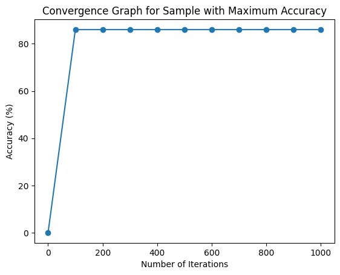

# SVM Parameter Optimization Project

## Introduction
This project aims to optimize the parameters of Support Vector Machine (SVM) models for classification tasks using a multiclass dataset from the UCI repository. The optimization process involves tuning the SVM parameters, including the regularization parameter (C), the kernel type, and the gamma parameter.

## Dataset
The dataset used in this project is the Statlog (Landsat Satellite) dataset obtained from the UCI Machine Learning Repository. It consists of remote sensing data captured by the Landsat satellite, with features representing different spectral bands. The dataset contains a total of 6 classes.

## Methodology
The SVM parameters are optimized using a random search approach. For each sample, the dataset is divided into training and testing sets with a 70-30 split. The SVM model is trained on the training set, and its performance is evaluated on the testing set using accuracy as the evaluation metric.

## Parameter Optimization Results
### Table of Best Parameters and Accuracy
The table below summarizes the best parameters and accuracy obtained for each sample:

| Sample Number | C       | Kernel | Gamma | Accuracy |
|---------------|---------|--------|-------|----------|
| 1             | 7.077   | poly   | 9.594 | 83.51    |
| 2             | 9.981   | poly   | 2.193 | 82.99    |
| 3             | 0.456   | linear | 0.625 | 83.51    |
| 4             | 8.896   | poly   | 9.973 | 84.02    |
| 5             | 1.502   | poly   | 5.394 | 81.44    |
| 6             | 6.657   | linear | 8.064 | 80.83    |
| 7             | 8.887   | poly   | 7.131 | 81.87    |
| 8             | 3.083   | linear | 3.530 | 78.76    |
| 9             | 6.488   | poly   | 1.612 | 86.01    |
| 10            | 0.242   | linear | 0.446 | 81.87    |

### Convergence Graph

## Conclusion
The random search optimization approach successfully identified the best SVM parameters for the classification task. We identified that sample 9 gave the best accuracy and its convergence graph demonstrates the relationship between the number of iterations and accuracy, indicating the convergence of the optimization process. 

